# ローカルで開発を始める前に

- ここでまででローカルにリポジトリをコピーできたと思いますですが，Github上での変更をローカルに取り込むことができませんその方法を残します

## リポジトリの同期
- メインのリポジトリと個人のリポジトリは親子関係にありますが，同期はしていませんそこで，最新に更新します
1. 変更のコピー
   - 個人のリポジトリにアクセスし，「main」ブランチであることを確認して，「Sync fork」ボタンをクリックします
   - そして，「Update branch」ボタンを押します
   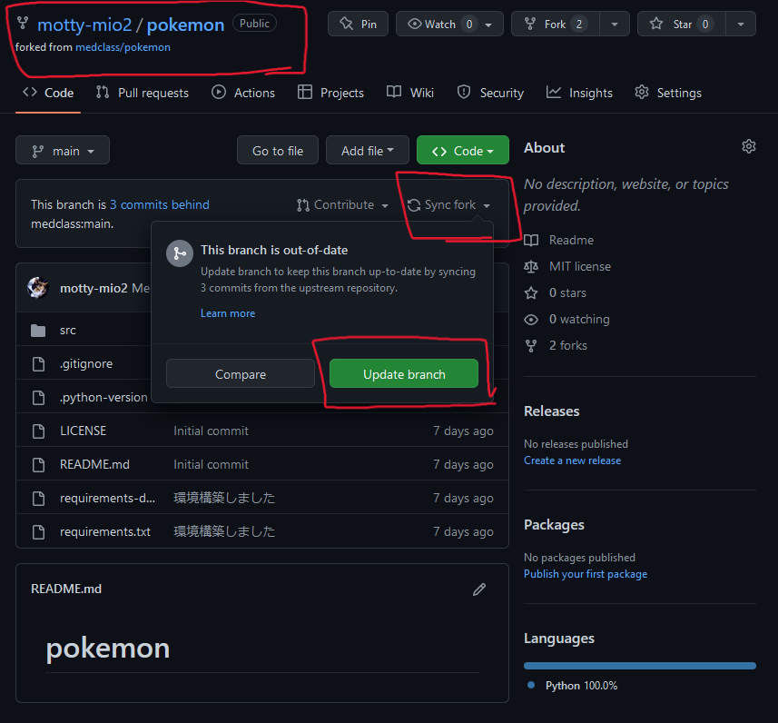
   - グレーになって押せなくなればOKです
   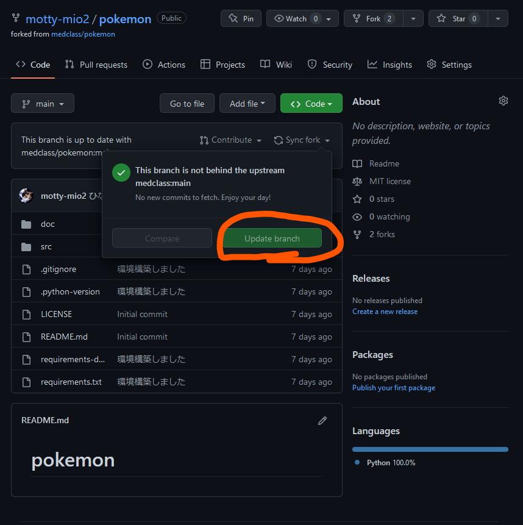
    
    
## ローカルでの作業準備
- 個人のGithubのリポジトリが最新になったので，次はローカルを最新にしましょう
1. VScode を開く
   - スタートメニューなどから，VScodeを起動します
   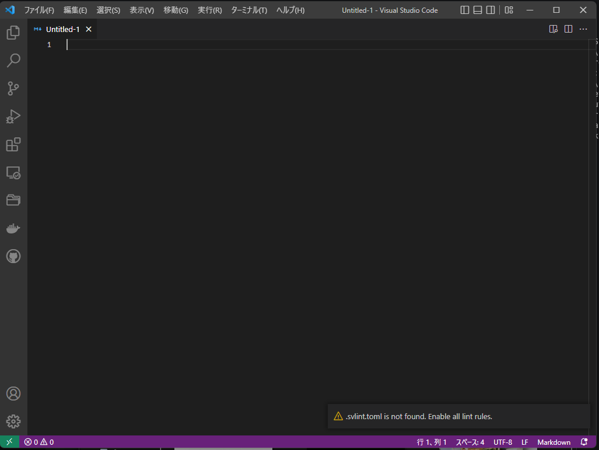
2. 「ファイル」メニューから「フォルダーを開く」を選択します
   - 中のほうにあります
   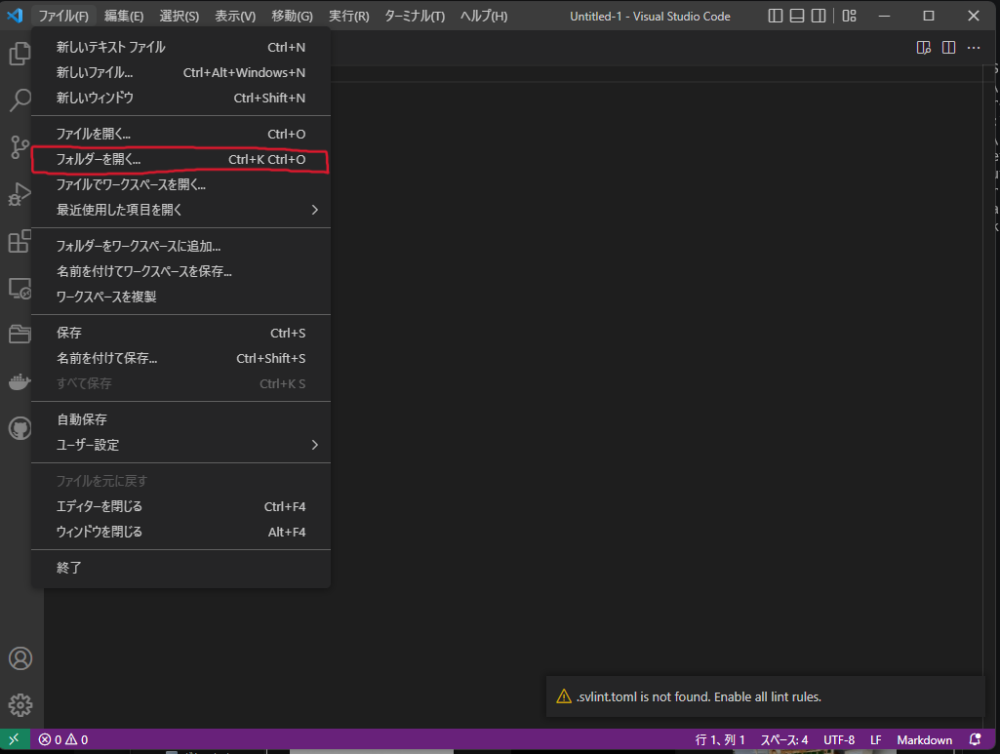
3. ダイアログから，ローカルのリポジトリを選択し，開きます
   - 場所は [init.md](./init.md)で `git clone` したところです
   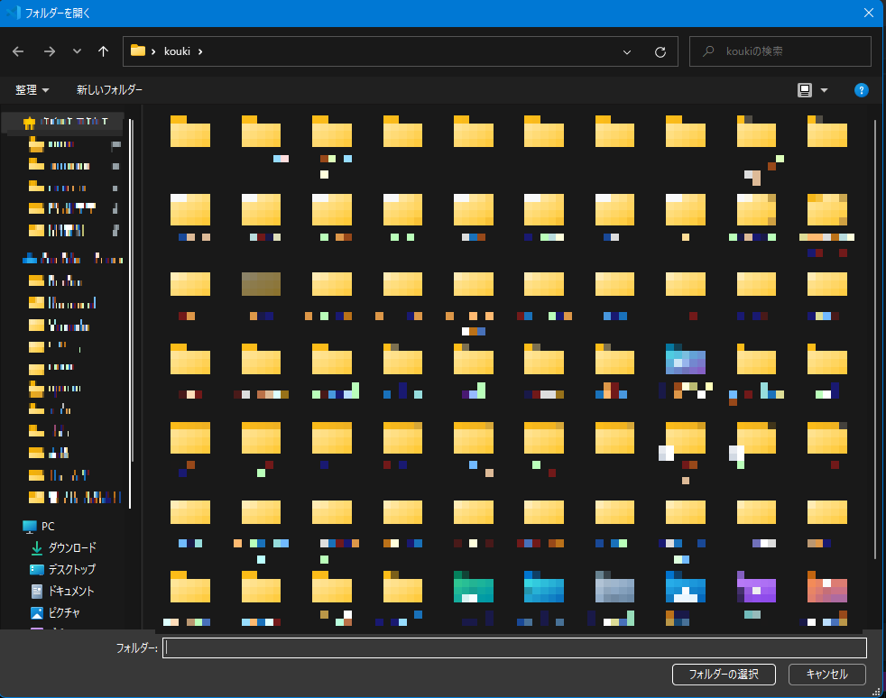
4. リポジトリが開かれる
   - 画面が更新されて，ファイルが表示されます
   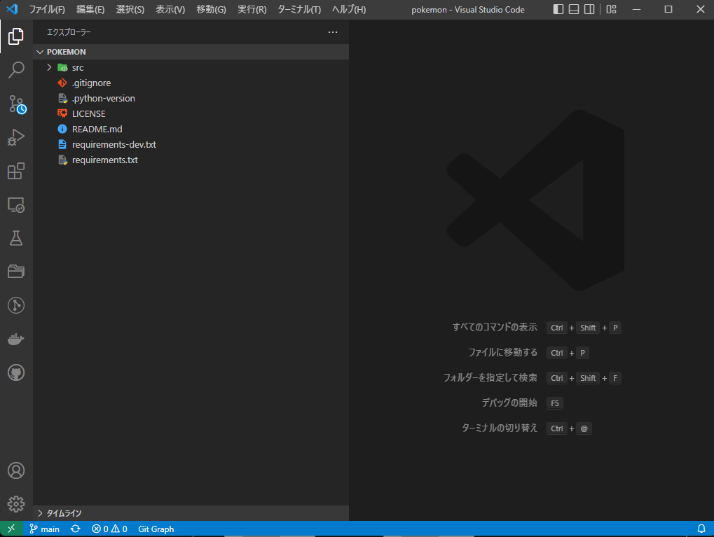
5. ローカルの同期
   - 画面左下の丸い矢印ボタンを押します
   - これで，Githubの更新をローカルにダウンロードします
   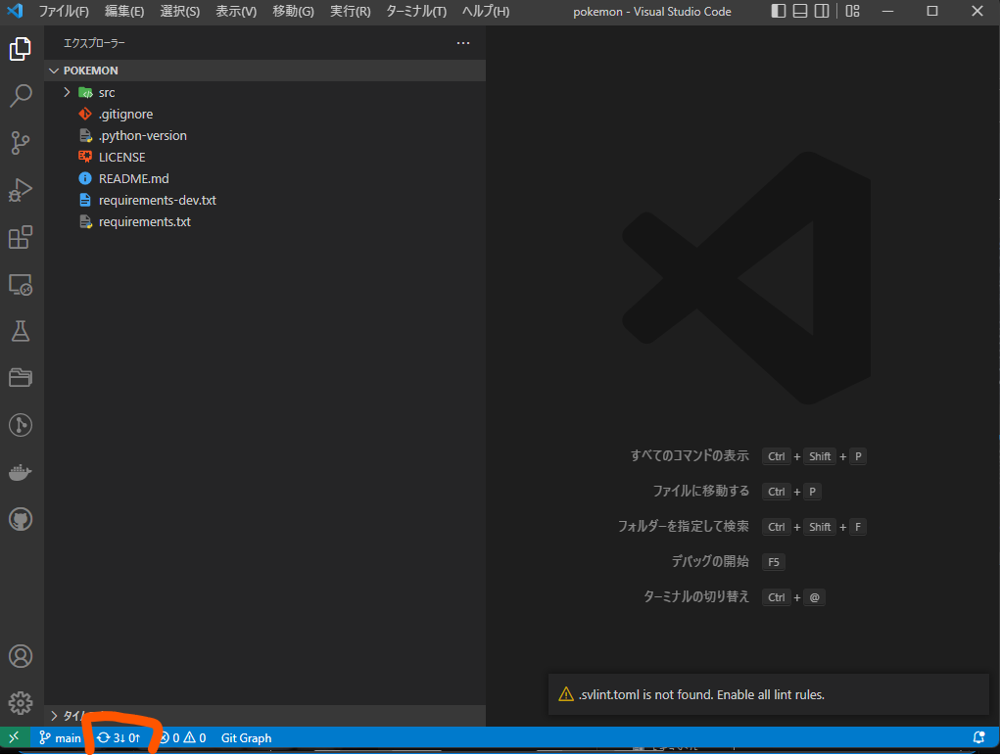
     
## ローカルでの環境分離
- このまま開発することもできますが，`main`ブランチはGithubの更新を受け取る場所でもあります
- `main`ブランチで開発すると，Githubの更新を受け取るときに変更点がぶつかってしまいます
- そこで，**ブランチ**というもので，環境を区切ります
1. ブランチを切る1
   - 画面左下の `main` をクリックします
   - すると，上部に何か出てきます
   - 上から2番目「分岐の作成元」をクリックします
   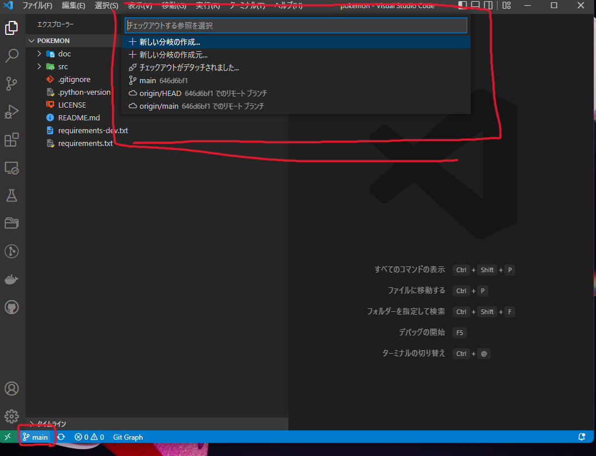
2. ブランチを切る2
   - 次に「ブランチ名」を入力します（英数字で）
     - ブランチ名とは一般に作業の名前（機能の追加やバグ修正 など）をつけます
     - 思いつかなければ，今日の日付の下4桁（0826 など）を入力して下さい
   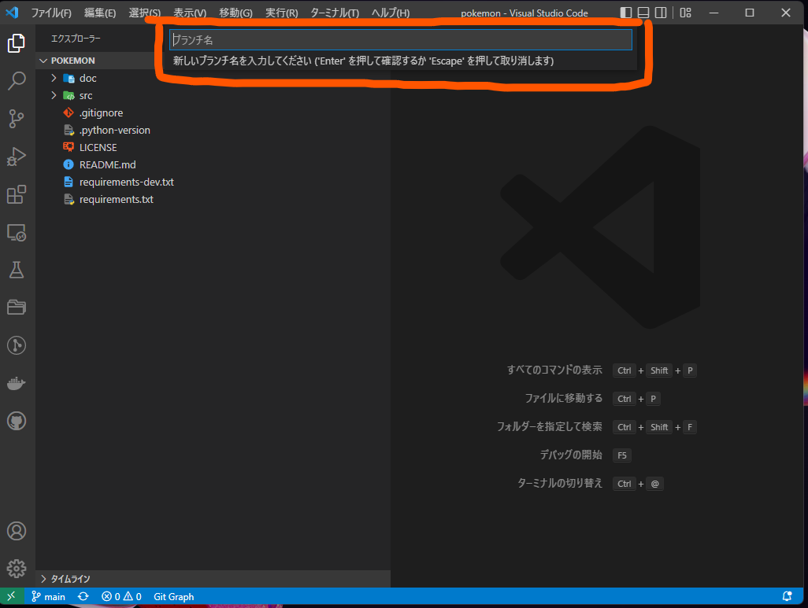
3. ブランチを切る3
   - `main`を選択します
     - ブランチとは「枝」のことです。
     - 文字通り，履歴を「枝分かれさせる根本」を指定してます
   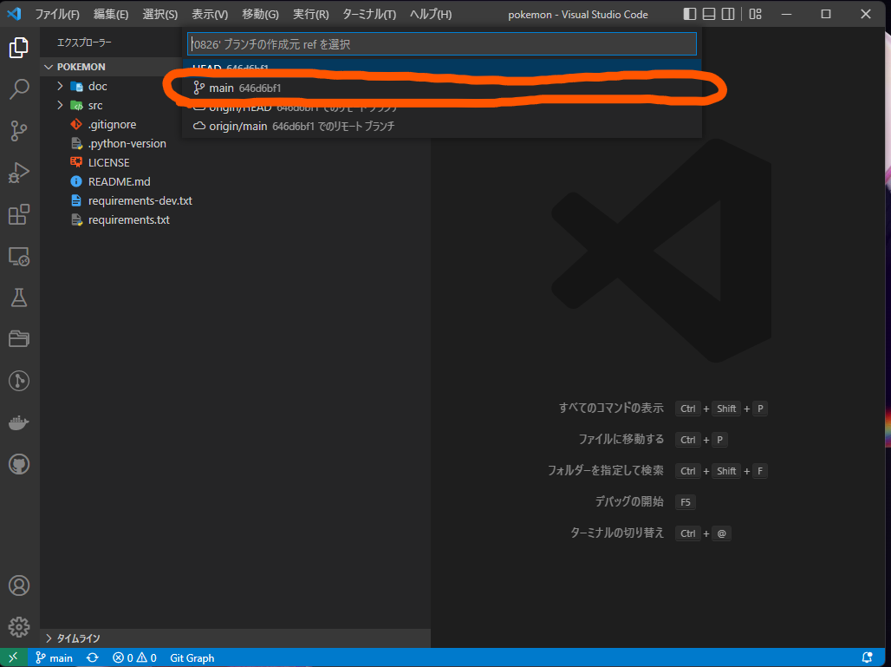
4. ブランチが切れた
   - ブランチが正常に切れた場合，画面の左下の表示が `2` で設定したブランチ名（ここでは**0826**）になります
   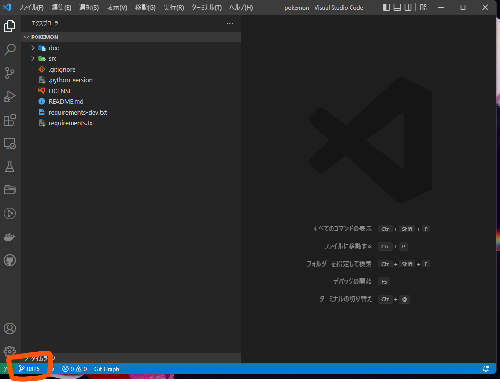
5. Githubに登録
   - 雲マークを押すと，上にバナーが出ます
   - そこで「origin」を選択します
     - Github にローカルの変更を送信する準備が整いました
   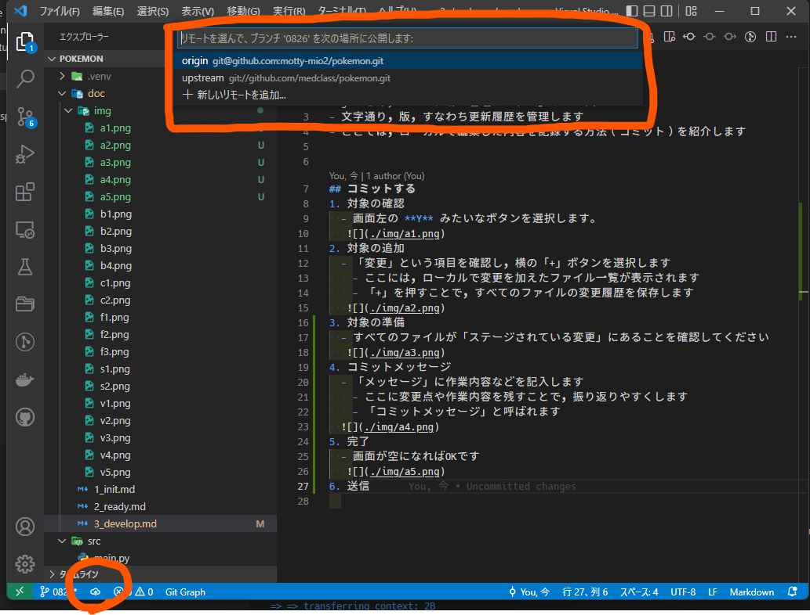
