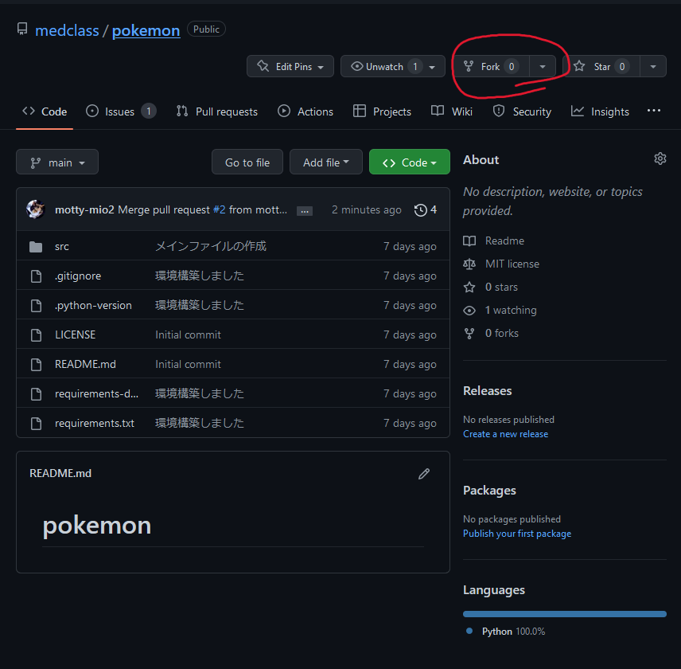
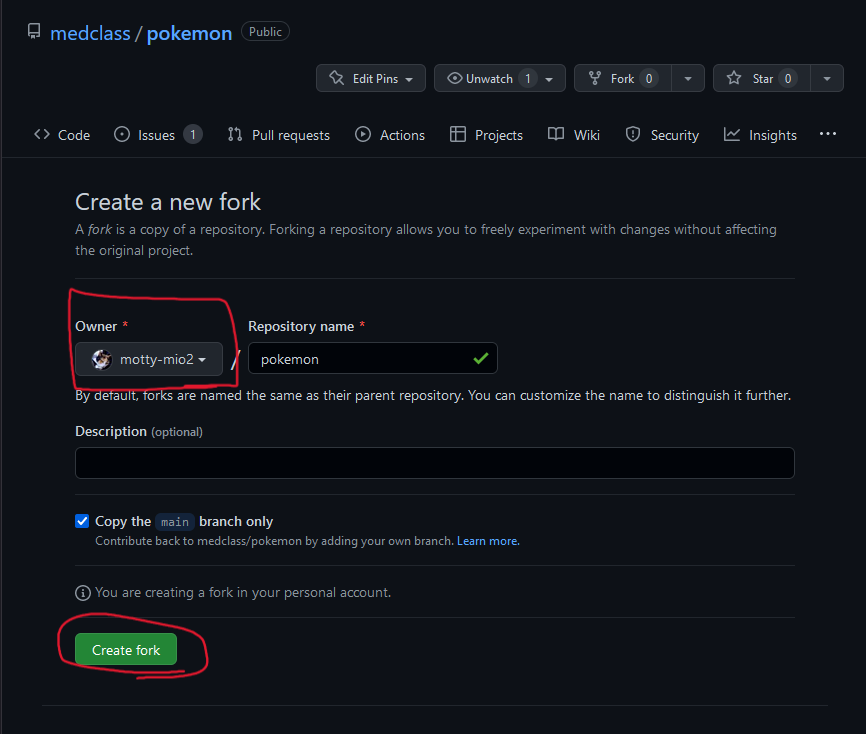
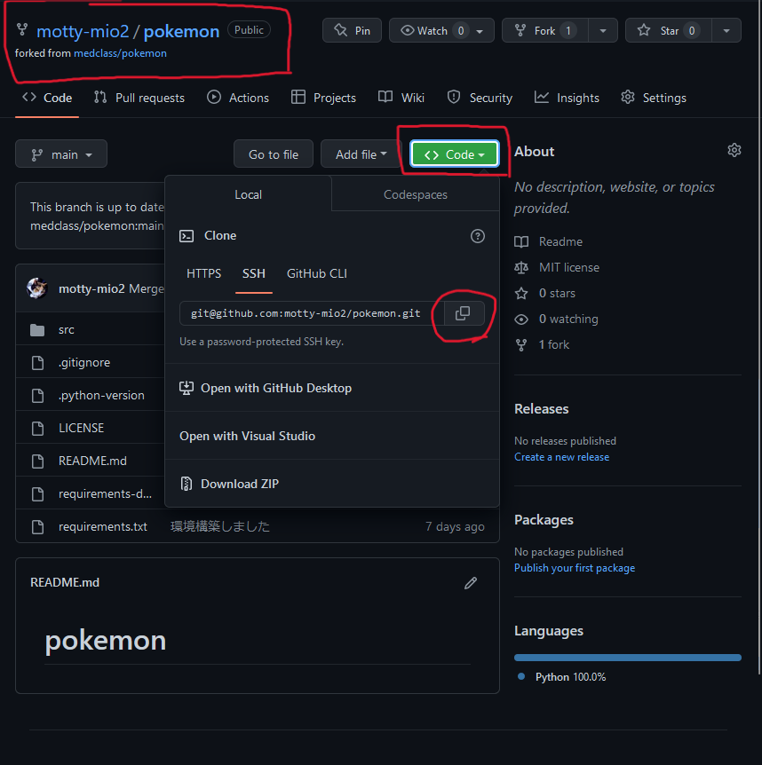
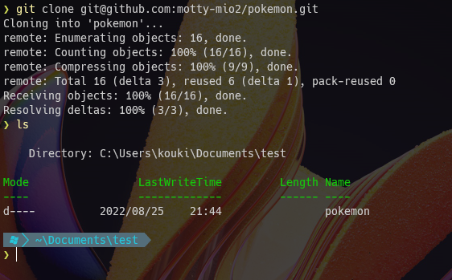

# はじめに
- Githubを初めて使う人に向けて情報をまとめました。

## 前提条件
- git の導入
  - git をインストールしてください
  - [https://prog-8.com/docs/git-env-win](https://prog-8.com/docs/git-env-win) が非常に参考になります。
- vscode の導入
  - 簡潔に済ますため，エディタはVS Codeで統一します
  - [https://miya-system-works.com/blog/detail/vscode-install/](https://miya-system-works.com/blog/detail/vscode-install/)がわかりやすいです。

## 最初にすること
- 個人ごとにリポジトリを用意します
  - 同じところで作業すると，皆さんの変更が衝突して，大変なことになります
  - そこでリポジトリ（プログラムを保存する場所）を自分の領域にコピーします。

1. Fork ボタンを押します。
  
2. Owner が自分のユーザー名になっていることを確認して，「Create fork」ボタンを押します。
  
3. リポジトリが「自分のユーザー名/pokemon」がになっていればOKです
  

## パソコンで作業する準備を整える
- GitHub上のリポジトリを，パソコンにコピーします
1. 接続先を確認します
  - 上で作成した**自分のリポジトリ**であることを確認して，緑の「Code」ボタンを押します
  - そして，□が重なったマークを押して，URLをコピーします
   
2. クローンします
  - リポジトリをパソコンにダウンロードします。
  - PowerShellを開いて，`cd` で作業したいフォルダに移動します。
  - その後 `git clone ` とコマンドを打ち，後ろに，先ほどコピーしたURLを貼り付けます。
  - ls を押して，ダウンロードされたかを確認します。
   